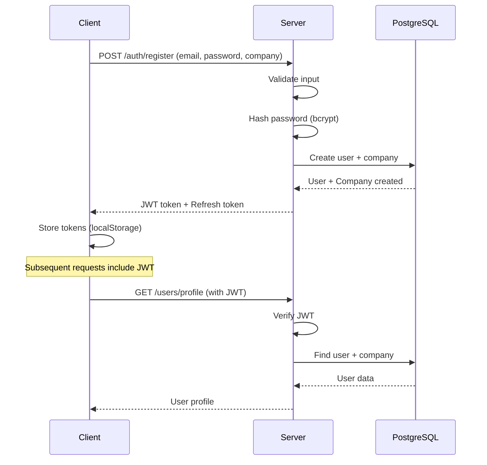

# Architecture et Flux de Données

## Vue d'ensemble

L'application SaaS PME suit une architecture classique client-serveur avec séparation des préoccupations :

```
┌─────────────────────────────────────────────────────────────┐
│                   CLIENT (Next.js/React)                    │
│  ┌──────────────────────────────────────────────────────┐   │
│  │  Pages & Components (Tailwind CSS)                   │   │
│  │  - Authentification                                  │   │
│  │  - Tableau de bord                                   │   │
│  │  - Gestion clients                                   │   │
│  │  - Gestion documents                                 │   │
│  │  - Génération factures                               │   │
│  │  - Chat IA                                           │   │
│  └──────────────────────────────────────────────────────┘   │
│                           │                                   │
│  ┌──────────────────────────────────────────────────────┐   │
│  │  State Management (Zustand + React Query)            │   │
│  │  - Auth Store                                        │   │
│  │  - Cache données                                     │   │
│  └──────────────────────────────────────────────────────┘   │
│                           │                                   │
│  ┌──────────────────────────────────────────────────────┐   │
│  │  API Client (Axios)                                  │   │
│  │  - Requêtes HTTP                                     │   │
│  │  - Gestion tokens JWT                                │   │
│  └──────────────────────────────────────────────────────┘   │
└──────────────────────────────┬──────────────────────────────┘
                               │
                        HTTPS / REST API
                               │
┌──────────────────────────────▼──────────────────────────────┐
│                 SERVER (Express.js/Node.js)                 │
│  ┌──────────────────────────────────────────────────────┐   │
│  │  Routes & Controllers                                │   │
│  │  - GET/POST/PUT/DELETE endpoints                     │   │
│  │  - Request validation (Zod)                          │   │
│  └──────────────────────────────────────────────────────┘   │
│                           │                                   │
│  ┌──────────────────────────────────────────────────────┐   │
│  │  Middleware                                          │   │
│  │  - Authentication (JWT)                              │   │
│  │  - Multi-tenant isolation                            │   │
│  │  - Error handling                                    │   │
│  └──────────────────────────────────────────────────────┘   │
│                           │                                   │
│  ┌──────────────────────────────────────────────────────┐   │
│  │  Business Logic (Services)                           │   │
│  │  - User management                                   │   │
│  │  - Document processing                               │   │
│  │  - Invoice generation                                │   │
│  │  - Chat IA                                           │   │
│  │  - Stripe integration                                │   │
│  └──────────────────────────────────────────────────────┘   │
│                           │                                   │
└──────────────────────────────┬──────────────────────────────┘
                    ┌──────────┼──────────┬──────────┐
                    │          │          │          │
        ┌───────────▼──┐  ┌────▼───┐ ┌──▼────┐ ┌──▼────────┐
        │  PostgreSQL  │  │ Redis  │ │ S3    │ │OpenAI API │
        │  (Database)  │  │(Cache) │ │(Files)│ │(IA)       │
        └──────────────┘  └────────┘ └───────┘ └───────────┘
                    │          │          │          │
                    └──────────┼──────────┴──────────┘
                               │
                    External Services Layer
```

## Flux d'authentification



## Flux multi-tenant

### Isolation des données

1. **Authentification**
   - L'utilisateur se connecte avec email + mot de passe
   - JWT généré incluant `userId`, `companyId`, `role`

2. **Autorisation**
   - Middleware `tenantMiddleware` vérifie le `companyId`
   - Chaque requête filtrée par `companyId`

3. **Sécurité des données**
   - Les utilisateurs d'une entreprise A ne peuvent accéder aux données de l'entreprise B
   - Les bases de données PostgreSQL utilisent des contraintes Foreign Key pour l'isolement
   - Les logs d'audit enregistrent qui accède à quoi

### Exemple d'isolation

```typescript
// Pour une requête GET /customers
// Middleware extraits le companyId du JWT
const { companyId } = req; // De JWT

// Le contrôleur filtre par companyId
const customers = await prisma.customer.findMany({
  where: { companyId }, // Garantit que seules les données de l'entreprise sont retournées
});
```

## Flux IA (OpenAI)

```
1. Utilisateur envoie un message au chat
   ↓
2. Message stocké en DB
   ↓
3. Récupération de l'historique de conversation
   ↓
4. Requête OpenAI API avec contexte
   ↓
5. Réponse IA stockée en DB
   ↓
6. Réponse envoyée au client
```

## Flux de paiement (Stripe)

```
1. Utilisateur sélectionne un plan
   ↓
2. Redirection à Stripe Checkout
   ↓
3. Paiement effectué
   ↓
4. Webhook Stripe vers notre API
   ↓
5. Mise à jour de la souscription en DB
   ↓
6. Activation des fonctionnalités payantes
```

## Flux de gestion des fichiers

```
1. Utilisateur upload un fichier
   ↓
2. Validation du type et taille
   ↓
3. Upload vers AWS S3
   ↓
4. Enregistrement URL en DB
   ↓
5. Si PDF/Document: envoi à OpenAI pour analyse
   ↓
6. Stockage de l'analyse en DB
```

## Sécurité

- **Authentification**: JWT tokens avec expiration
- **Autorisation**: RBAC (Role Based Access Control)
- **Chiffrement**: Bcrypt pour les mots de passe
- **HTTPS**: Communication sécurisée
- **CORS**: Politique stricte
- **SQL Injection**: Prisma ORM (parameterized queries)
- **XSS**: React sanitization native
- **Rate Limiting**: À implémenter sur les endpoints sensibles
- **Audit**: Logs d'audit pour traçabilité

## Performance

- **Caching**: Redis pour les données fréquemment accédées
- **Pagination**: Limiter les résultats
- **Indexes**: Créés sur les colonnes fréquemment filtrées (companyId, userId)
- **CDN**: S3 avec CloudFront pour les fichiers
- **Lazy Loading**: Frontend avec React Query + code splitting

## Scaling

### Vertical Scaling
- Augmenter les ressources serveur
- Base de données replicated

### Horizontal Scaling
- Multiples instances backend
- Load balancer (AWS ELB, Nginx)
- Base de données avec réplication
- Redis cluster pour le cache

## Déploiement

### Développement
```bash
docker-compose up
```

### Production
- Container orchestration (Kubernetes)
- CI/CD pipeline (GitHub Actions)
- Monitoring & Logging (CloudWatch, ELK)
- Backup & Disaster recovery
